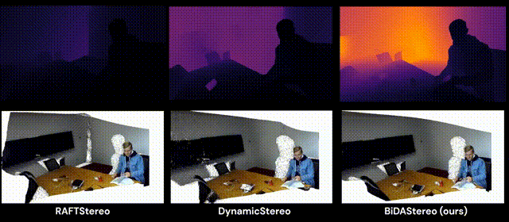

# Match-Stereo-Videos: Bidirectional Alignment for Consistent Dynamic Stereo Matching.

**[Imperial College London](https://www.imperial.ac.uk/)**

[Junpeng Jing](https://nikitakaraevv.github.io/), [Ye Mao](https://yebulabula.github.io/), [Krystian Mikolajczyk](https://www.imperial.ac.uk/people/k.mikolajczyk)

[[`Paper`](https://arxiv.org/abs/2403.10755)] [[`Project`](https://tomtomtommi.github.io/BiDAStereo/)]



## Dataset

Download the following datasets and put in `./data/datasets`:
 - [SceneFlow](https://lmb.informatik.uni-freiburg.de/resources/datasets/SceneFlowDatasets.en.html)
 - [Sintel](http://sintel.is.tue.mpg.de/stereo)

Download the following dataset and link to the project `ln -s ./dynamic_replica ./bidastereo/`:
 - [Dynamic_Replica](https://dynamic-stereo.github.io/)


## Installation

Installation of BiDAStereo with PyTorch3D, PyTorch 1.12.1 & cuda 11.3

### Setup the root for all source files:
```
git clone https://github.com/TomTomTommi/BiDAStereo
cd bidastereo
export PYTHONPATH=`(cd ../ && pwd)`:`pwd`:$PYTHONPATH
```
### Create a conda env:
```
conda create -n bidastereo python=3.8
conda activate bidastereo
```
### Install requirements
```
conda install pytorch==1.12.1 torchvision==0.13.1 torchaudio==0.12.1 cudatoolkit=11.3 -c pytorch
pip install "git+https://github.com/facebookresearch/pytorch3d.git@stable"
pip install -r requirements.txt
```

## Evaluation
To download the checkpoints, click the links below. Copy the checkpoints to `./bidastereo/checkpoints/`.

- [BiDAStereo](https://github.com/TomTomTommi/BiDAStereo/releases/tag/v0.0) trained on SceneFlow
- [BiDAStereo](https://github.com/TomTomTommi/BiDAStereo/releases/tag/v0.0) trained on SceneFlow and Dynamic Replica

To evaluate BiDAStereo:
```
sh evaluate_bidastereo.sh
sh evaluate_real.sh
```
The results are evaluated on an A6000 40GB GPU.
Evaluation on *Dynamic Replica* requires a 32GB GPU. If you don't have enough GPU memory, you can modify `kernel_size` from 20 to 10.

## Training
Training requires 8 V100 32GB GPUs or 4 A100 80GB GPUs. You can decrease `image_size` and / or `sample_len` if you don't have enough GPU memory.
```
sh train_bidastereo.sh
```

## Citing BiDAStereo
If you use BiDAStereo in your research, please use the following BibTeX entry.
```
@article{jing2024matchstereovideos,
  title={Match-Stereo-Videos: Bidirectional Alignment for Consistent Dynamic Stereo Matching}, 
  author={Junpeng Jing and Ye Mao and Krystian Mikolajczyk},
  year={2024},
  eprint={2403.10755},
  archivePrefix={arXiv},
  primaryClass={cs.CV}
}
```
## Acknowledgement

In this project, we use parts of public codes and thank the authors for their contribution in:
- [DynamicStereo](https://github.com/facebookresearch/dynamic_stereo)
- [RAFT](https://github.com/princeton-vl/RAFT)
